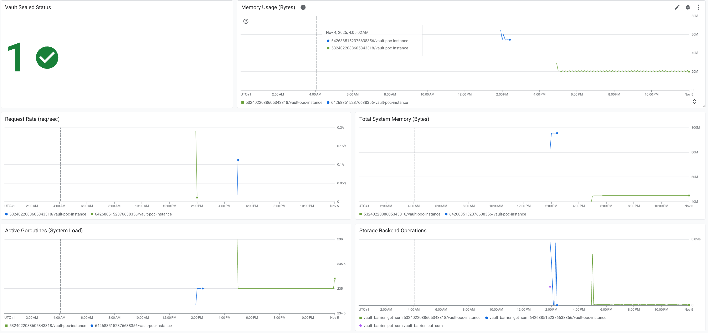

# Vault + GCP Monitoring PoC

Simple PoC to deploy HashiCorp Vault on GCP and ship metrics/logs to Cloud Monitoring using Terraform. Keep it minimal, fast to try, and easy to tear down.

## What This Includes

- Vault VM on GCP (startup installs Vault)
- Basic firewall and service account
- Google Ops Agent for metrics/logs
- Terraform for a dashboard, alerts, and uptime check

## Project Structure

```
vault-gcp-metrics-lab/
├── 1-infrastructure/               # Phase 1: Core infrastructure
│   ├── main.tf                     # VM, Service Account, Firewall, APIs
│   ├── variables.tf                # Infrastructure variables
│   ├── outputs.tf                  # VM details, IPs, SSH command
│   ├── terraform.tfvars            # Your configuration
│   └── scripts/
│       └── startup.sh              # VM startup script (installs Vault)
│
├── 2-monitoring/                   # Phase 2: Monitoring & alerts
│   ├── main.tf                     # Dashboards, Alerts, Uptime Checks
│   ├── variables.tf                # Monitoring variables
│   ├── outputs.tf                  # Dashboard & alert URLs
│   └── terraform.tfvars            # Monitoring configuration
│
├── README.md                       # This file (overview + quick start)
├── DEPLOYMENT.md                   # Step-by-step guide
└── 01-dashboard-overview.png       # Dashboard screenshot
```

## Quick Start

Full steps are in [`DEPLOYMENT.md`](DEPLOYMENT.md). The short version:

1) Prereqs: GCP project, Terraform, gcloud CLI
2) Auth: `gcloud auth login && gcloud auth application-default login`
3) Phase 1: `cd 1-infrastructure && terraform init && terraform apply`
4) SSH and initialize Vault (save token + unseal key)
5) Phase 2: `cd ../2-monitoring && terraform init && terraform apply`
6) Verify metrics, dashboard, and alerts

### Commands

```bash
# Authenticate to GCP
gcloud auth login
gcloud auth application-default login
gcloud config set project YOUR_PROJECT_ID

# Phase 1: Deploy infrastructure
cd 1-infrastructure
terraform init
terraform apply

# Phase 2: Configure Vault (manual)
gcloud compute ssh vault-poc-instance --zone=us-central1-a
sudo /root/initialize-vault.sh
vault operator unseal
vault login
sudo -E bash /root/configure-monitoring.sh

# Phase 3: Deploy monitoring
cd ../2-monitoring
terraform init
terraform apply
```


For detailed steps, see [`DEPLOYMENT.md`](DEPLOYMENT.md).

### Verify

- Metrics: GCP → Monitoring → Metrics Explorer → search "vault"
- Dashboard: GCP → Monitoring → Dashboards → "Vault Production Monitoring"
- Logs: GCP → Logging → Logs Explorer → query `vault_audit`
- UI: open Vault UI URL from Terraform output



## Notes

- This is a PoC (not production-hardened). Use your own judgment before adapting further.
- To save costs, stop or destroy resources when not needed.

